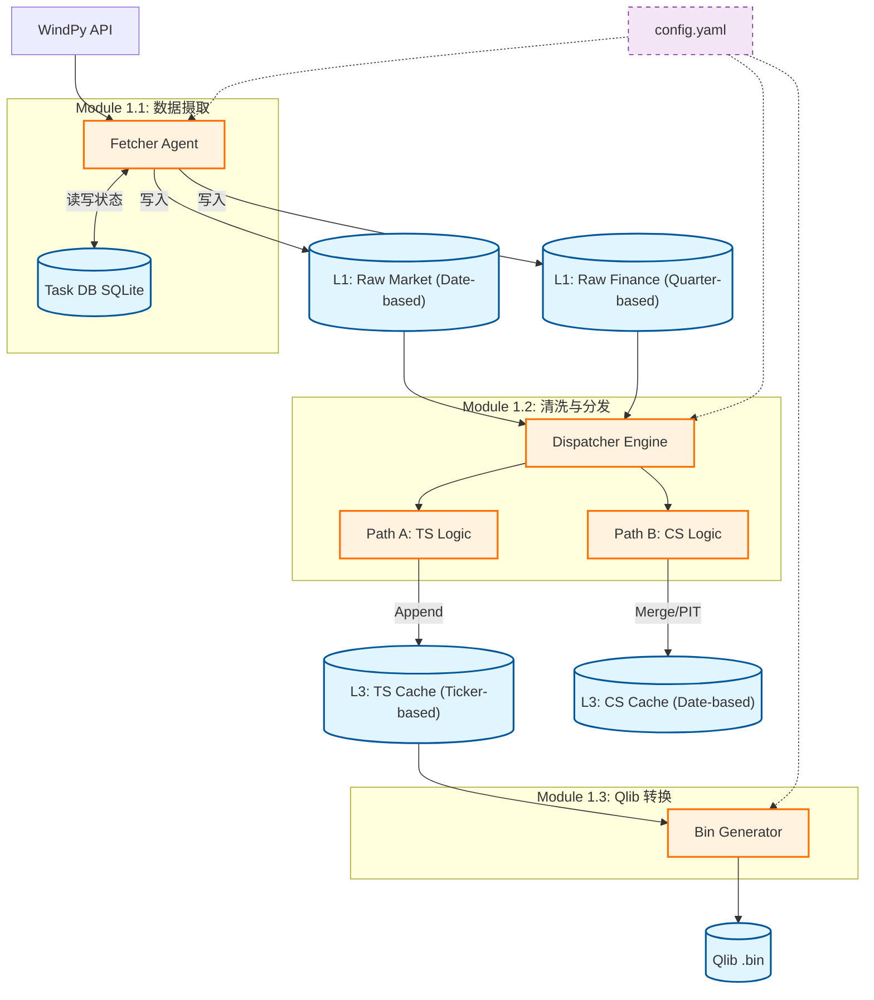
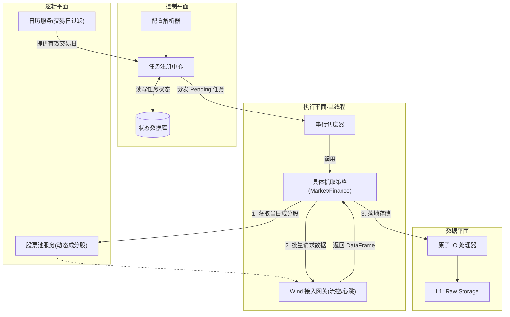

# Phase 1: 数据基础设施

## 1\. 架构概述 (Architectural Overview)

本阶段旨在构建一套**高可用、低耦合、可回溯**的量化数据底座。系统采用 **“T型数据流向”** 结合 **“三层存储模型 (Medallion Architecture)”**，将外部不稳定的数据源（Wind）转化为内部标准化的计算视图（Qlib/Barra）。

**核心设计目标**：

1.  **隔离性**：Raw Layer 镜像隔离了 Wind 接口的不稳定性。
    
2.  **多态性**：一套原始数据，通过分发层同时生成“时序视图（View A）”和“截面视图（View B）”。
    
3.  **配置驱动**：所有路径、参数、任务开关均通过 `config.yaml` 集中管理。
    

* * *

## 2\. 项目目录结构规范 (Directory Structure)

这是系统的物理骨架，所有后续开发必须严格遵循此规范，禁止硬编码路径。

Plaintext

    Quant_Project_Root/
    ├── config.yaml                 # [核心] 全局配置与字段映射
    ├── run_pipeline.py             # [入口] CLI 命令行入口
    │
    ├── src/                        # 源代码
    │   ├── __init__.py
    │   ├── data_ingestion.py       # [Module 1.1] 包含 Fetcher 与 FlowControl
    │   ├── data_etl.py             # [Module 1.2] 包含 Dispatcher, Path A/B Logic
    │   ├── qlib_adaptor.py         # [Module 1.3] 包含 Bin Generator
    │   └── utils.py                # [通用] Logger, IO, TaskDB Manager
    │
    ├── data/                       # 数据仓库
    │   ├── raw/                    # [L1] 原子镜像 (只读)
    │   │   ├── market/             # YYYYMMDD.parquet
    │   │   └── finance/            # YYYY_Q#.parquet
    │   │
    │   ├── app_cache/              # [L3] 应用视图 (读写)
    │   │   ├── ts_data/            # Path A: 按 Ticker (000001.SZ.parquet)
    │   │   └── cs_data/            # Path B: 按 Date (20240102.parquet)
    │   │
    │   └── qlib_bin/               # [Target] Qlib 二进制
    │       ├── calendars/
    │       ├── features/
    │       └── instruments/
    │
    ├── meta/                       # 运行时状态
    │   └── task_status.db          # SQLite: 记录断点与任务状态
    │
    └── logs/                       # 运行日志
        └── system.log

* * *

## 3\. 全局配置管理 (Configuration Specification)

`config.yaml` 是系统的控制中枢。它定义了所有的**易变参数**，确保代码本身是无状态的。

YAML

    # config.yaml (V2.2)

    # --- 系统基础 ---
    system:
    project_root: "."
    log_level: "INFO"
    n_jobs: 8                     # 并行核心数
    timezone: "Asia/Shanghai"

    # --- 存储路径 (严格对应目录结构) ---
    storage:
    # L1: 原子层
    raw_market: "./data/raw/market"
    raw_finance: "./data/raw/finance"
    
    # L3: 视图层
    view_ts: "./data/app_cache/ts_data"
    view_cs: "./data/app_cache/cs_data"
    
    # Target: Qlib
    qlib_bin: "./data/qlib_bin"
    
    # Meta & Logs
    task_db: "./meta/task_status.db"
    log_file: "./logs/system.log"

    # --- 模块 1.1: 数据源 (Wind) ---
    wind:
    enabled: true
    retry_limit: 3
    batch_size: 50                # 单次请求股票数
    request_gap: 0.5              # 请求间隔(秒), 防止封号

    # --- 模块 1.2: 字段映射 (Wind -> Internal) ---
    # 将字段映射直接写在配置里，便于动态修改
    schema:
    # 行情字段映射
    market_map:
        OPEN: "open"
        HIGH: "high"
        LOW: "low"
        CLOSE: "close"
        VOLUME: "volume"
        AMT: "amount"
        VWAP: "vwap"
        ADJFACTOR: "adjfactor"
        PCT_CHG: "pct_chg"
    
    # 财务字段映射 (WSS)
    finance_map:
        NET_PROFIT_IS: "net_profit"       # 归母净利润
        TOT_ASSETS: "total_assets"        # 总资产
        TOT_EQUITY: "total_equity"        # 股东权益
        S_VAL_MV: "total_mv"              # 总市值
        DQ_MV: "float_mv"                 # 流通市值 (Barra权重)

    # --- 数据范围 ---
    scope:
    start_date: "2019-01-01"
    end_date: "auto"              # auto = current date
    universe_path: "all"          # all = 全A股

    # --- Phase 2 预留 ---
    barra:
    risk_factors: ["size", "mom", "vol", "liq", "value"]
* * *

## 4\. 系统逻辑拓扑 (System Topology)

* * *

## 5\. 模块功能边界定义

### 模块 1.1: Data Ingestion (数据摄取)

-   **输入**：Wind API, `config.yaml` (日期范围)。
    
-   **输出**：`data/raw/` 下的 Parquet 文件。
    
-   **核心职责**：
    
    -   **Connectivity**：维护 Wind 会话，处理心跳。
        
    -   **Resiliency**：查询 `meta/task.db`，跳过已成功的日期，仅抓取缺失数据。
        
    -   **Safety**：只做最低限度的 Schema 检查（确保 Price 是 Float），不篡改数据内容。
        

### 模块 1.2: ETL Dispatcher (清洗分发)

-   **输入**：`data/raw/` (L1)。
    
-   **输出**：`data/app_views/` (L3)。
    
-   **核心职责**：
    
    -   **Path A (时序)**：将 Raw 中的“日切片”数据，转置追加到 TS Bucket 的“个股”文件中。
        
    -   **Path B (截面)**：执行 PIT (Point-in-Time) 对齐，将行情与最新的财务数据合成，计算基础衍生特征（如 `Log_Cap`），生成 Barra 所需的“日快照”。
        

### 模块 1.3: Qlib Adaptor (格式转换)

-   **输入**：`data/app_views/ts_bucket/`。
    
-   **输出**：`data/qlib_bin/`。
    
-   **核心职责**：
    
    -   生成 Qlib 索引文件 (`calendars`, `instruments`).
        
    -   将 Parquet 列式数据压缩为 Qlib 的 Compact Binary 格式。
        
    -   确保转换过程的并行化效率。

# 模块 1.1: Data Ingestion 详细架构设计 (V1.0)

## 1\. 设计概述 (Executive Summary)

### 1.1 设计目标

构建一个针对 WindPy 接口特性的**高可用**数据抓取子系统。该模块负责将 Wind 金融终端的原始行情与财务数据，安全、完整地落地到本地磁盘的 **Raw Layer (原子镜像层)**。

### 1.2 核心痛点解决方案

-   **稳定性 (Stability)**：通过令牌桶流控与指数退避重试，解决 Wind 接口易断连、限流的问题。
    
-   **正确性 (Correctness)**：采用**动态股票池 (Dynamic Universe)** 策略，彻底规避历史回测中的“幸存者偏差”。
    
-   **完整性 (Completeness)**：引入**交易日历过滤**服务，确保仅在有效交易日执行抓取，避免无效数据污染。
    

### 1.3 关键技术约束

-   **线程模型**：强制 **单线程串行 (Single-Threaded)** 执行，严禁使用多进程/多线程调用 WindPy（受限于 Windows COM 组件特性）。
    
-   **原子写入**：所有文件写入必须遵循“写入临时文件 -> 校验 -> 重命名”的原子操作协议。

我们将采用面向对象 (OOP) 设计，通过继承和组合来实现逻辑复用。

## 2\. 系统架构 (System Architecture)

### 2.1 逻辑拓扑图

该模块采用 **生产者-消费者 (Producer-Consumer)** 的变体模式，结合 **状态机** 管理任务生命周期。

## 3\. 组件详细设计 (Component Specifications)

### 3.1 基础设施层：WindService (接入网关)

-   **设计模式**：单例模式 (Singleton) + 上下文管理器 (Context Manager)。
    
-   **功能定义**：
    
    -   **会话保活**：负责 `w.start()` 启动与心跳监测，断线自动重连。
        
    -   **流量整形 (Traffic Shaping)**：内置**令牌桶算法**。在调用 API 前检查令牌，强制执行请求间隔（如 0.5s），防止高频封号。
        
    -   **异常封装**：拦截 Wind 原生错误码，抛出系统定义的标准异常（如 `QuotaExceededError`, `TimeoutError`）。

    
    -   `get_data(api_func, options)`: 统一的 API 调用入口，封装了重试 (Retry) 和流控 (Sleep) 逻辑。
               

### 3.2 业务逻辑层：CalendarService (日历服务)

-   **功能定义**：
    
    -   作为任务生成的过滤器。
        
    -   根据配置的起止日期，调用 Wind 接口获取**标准交易日序列**，剔除周末与法定节假日。
        
    -   防止系统在休市日尝试抓取数据而产生报错日志。
        

### 3.3 业务逻辑层：TaskRegistry (任务注册中心)

负责与 `meta/task_status.db` 交互，充当任务调度的大脑。

-   **功能定义**：
    
    -   负责任务的**初始化**、**分发**与**状态更新**。
        
    -   **幂等性设计**：启动时扫描数据库，仅针对（`Target Date` 存在于日历 且 `Status` != 'SUCCESS'）的日期生成任务。
        
    -   **状态机流转**：
        
        -   `PENDING` -> `RUNNING` -> `SUCCESS`
            
        -   `RUNNING` -> `FAILED` (记录错误堆栈，增加 Retry 计数)

-   **职责**：
    
    -   **Init**: 根据 `config.yaml` 的日期范围，初始化任务列表。
        
    -   **Filter**: 在运行前，查询数据库，返回 `pending` 或 `failed` 的任务列表（实现断点续传）。
        
    -   **Log**: 更新任务状态 `(date, task_type, status, error_msg, timestamp)`。   

### 3.4 执行策略层：`BaseFetcher` 

#### 3.4.1 `BaseFetcher`

这是所有抓取器的父类，负责通用流程的控制。

-   **核心方法 `run_task(task_info)` (Template Method)**:
    
    -   这是**对外暴露的唯一入口**，包含不可变的算法骨架：
        
        1.  `_before_fetch()`: 钩子方法，做些日志记录。
            
        2.  `data = self._fetch_data(task_info)`:  调用子类逻辑。
            
        3.  `if data is None`: 抛出异常或处理空数据。
            
        4.  `self._validate_data(data)`: 调用子类校验。
            
        5.  `self._save_atomic(data, path)`: 执行原子写入。
            
        6.  `_after_fetch()`: 更新数据库状态。
            
        7.  **异常捕获**: 统一处理 `WindError` 和网络异常，实现重试逻辑。
            
-   **具体方法 `_save_atomic(df, path)`**:
    
    -   实现 `Write Temp -> Check Size -> Rename` 的原子操作。
        

#### 3.4.2 `MarketFetcher`

这是专门处理**日频行情**的子类。

-   **实现抽象方法 `_fetch_data(task_info)`**: 此处融合了之前讨论的所有核心逻辑（动态池、分片、迭代）。
    
    -   **逻辑流程**:
        
        1.  **获取动态 Universe**: 调用 `w.wset("sectorconstituent", f"date={target_date};sectorid=a001010100000000")`。
            
            -   _目的_: 拿到当天实际在市的所有股票（包含退市股），解决幸存者偏差。
                
        2.  **分片 (Batching)**: 将获取到的 5000+ 代码列表，按 `config.batch_size` (如 500) 切分为多个 chunk。
            
        3.  **迭代请求 (Loop)**:
            
            -   遍历每个 chunk。
                
            -   调用 `WindService.instance().query("wsd", chunk, fields, ...)`。
                
            -   **注意**: 必须将 `PriceAdj` 设为 `U` (不复权)。
                
        4.  **合并 (Merge)**: 使用 `pd.concat(chunks)` 将碎片拼接为完整 DataFrame。
            
        5.  **清洗 (Sanitize)**:
            
            -   将列名重命名为小写 (e.g., `CLOSE` -> `close`)。
                
            -   强制类型转换: `Price` -> `float32`, `Volume` -> `float64`。
                
    -   **返回**: 清洗后的 DataFrame。
        
-   **实现抽象方法 `_validate_data(df)`**:
    
    -   检查 `df.shape[0]` 是否接近 Universe 的数量（允许少量停牌差异，但不能为 0）。
        
    -   检查关键字段（如 `close`）是否存在。

#### 3.4.3 `FinanceFetcher`
与 `MarketFetcher` 不同，财务抓取的核心在于 **`w.wss` (截面数据)** 的使用和 **`rptDate` (报告期)** 参数的设置。

-   **输入**: 任务 ID，例如 `"FIN_2023Q3"`。
    
-   **步骤 1: 报告期解析 (Date Parsing)**
    
    -   将 `Q1/Q2/Q3/Q4` 转换为标准的会计报告日：
        
        -   Q1 -> `YYYY0331`
            
        -   Q2 -> `YYYY0630` (中报)
            
        -   Q3 -> `YYYY0930`
            
        -   Q4 -> `YYYY1231` (年报)
            
    -   _目的_: 确定 Wind API 的 `rptDate` 参数。
        
-   **步骤 2: 获取历史截面 Universe (Dynamic Universe)**
    
    -   调用 `w.wset("sectorconstituent", f"date={report_date};sectorid=a001010100000000")`。
        
    -   _注意_: 使用报告期末作为截面日期，可以最大程度涵盖当时在市发布财报的股票（包含后续退市的）。
        
-   **步骤 3: 分片调用 `w.wss` (Batching with Snapshot)**
    
    -   将股票列表按 `config.batch_size` (建议 1000，`wss` 比 `wsd` 更轻量) 切分。
        
    -   **API 调用**:
        
        Python
        
            # 伪代码
            wind_data = w.wss(
                codes=batch_codes,
                fields="stm_issuingdate, net_profit_is, tot_equity, ...", # 包含公告日和财务指标
                options=f"rptDate={report_date};currencyType=;unit=1"
            )
        
    -   **关键字段强制**: 必须请求 `stm_issuingdate` (公告日期) 或 `ann_dt`。这是后续做“去未来函数”处理的唯一依据。
        
-   **步骤 4: 数据清洗**
    
    -   **重命名**: 将 `stm_issuingdate` 统一重命名为 `announce_date`。
        
    -   **格式统一**: 确保 `announce_date` 为 `YYYYMMDD` 字符串或 `datetime` 类型，方便后续排序。
        

#### 4\. 校验逻辑实现 (`_validate_data`)

-   **行数校验**: 检查返回的 DataFrame 行数是否与请求的 Universe 数量一致。
    
-   **关键列校验**: 检查 `net_profit` (净利润) 和 `announce_date` (公告日) 是否存在。
    
-   **空值策略**:
    
    -   对于财务数据，大量 `NaN` 是正常的（有些公司发布晚，或者某些指标不适用）。
        
    -   **Raw Layer 原则**: **保留 `NaN`**，不要填充 0，留给下游 ETL 处理。
        

* * *

> 总结：Market vs Finance 抓取策略对比

为了让开发更清晰，我整理了这两者的核心区别表：

| 特性  | MarketFetcher (行情) | FinanceFetcher (财务) |
| --- | --- | --- |
| **循环维度** | 交易日 (Trading Day) | 报告期 (Quarter End) |
| **任务频率** | 约 250 次/年 | 4 次/年 |
| **Wind 接口** | `w.wsd` (序列数据接口) | `w.wss` (多维数据接口) |
| **核心参数** | `tradeDate=YYYYMMDD` | `rptDate=YYYYMMDD` |
| **关键字段** | `close`, `volume`, `adjfactor` | `net_profit`, `equity`, **`announce_date`** |
| **PIT 处理** | 天然 PIT (每日生成) | **需依赖 `announce_date` 字段** |
| **文件命名** | `market/20240102.parquet` | `finance/2023_Q3.parquet` |

* * *

## 4\. 数据库设计 (Schema Design)

文件位置: `meta/task_status.db` (SQLite)

我们需要两张表来精细控制状态：

### Table 1: `ingestion_log` (任务队列表)

| 字段名 | 类型  | 说明  |
| --- | --- | --- |
| `task_id` | TEXT | 主键，格式 `MARKET_20240102` 或 `FIN_2023Q3` |
| `task_type` | TEXT | 枚举: `market` / `finance` |
| `target_date` | TEXT | 目标日期 (YYYYMMDD) |
| `status` | TEXT | `PENDING`, `SUCCESS`, `FAILED` |
| `retry_count` | INT | 当前重试次数 |
| `last_update` | DATETIME | 最后更新时间 |

### Table 2: `error_trace` (错误追踪表)
用于事后分析 Wind 报错原因（如流量超限、无权限等）。

| 字段名 | 类型 | 说明 |
| :--- | :--- | :--- |
| log_id | INTEGER | 自增 ID (Primary Key) |
| task_id | TEXT | 外键 (关联 ingestion_log 的 task_id 或 unique_id) |
| wind_code | INTEGER | Wind 返回的错误码 (e.g., -40520007) |
| error_msg | TEXT | 具体的异常堆栈信息 |
| created_at | TEXT | 错误发生时间 (ISO8601) |

* * *

## 5\. 核心逻辑流程详解

本模块采用 **多态策略 (Polymorphism)**。虽然 `BaseFetcher` 定义了统一的 `Chunk -> Fetch -> Concat` 骨架，但底层的 API 交互逻辑在两个子类中是截然不同的。

### 5.1 策略 A: 日频行情抓取 (Market Data Strategy)

-   **执行者**: `MarketFetcher`
    
-   **目标**: 获取某一个**交易日**的全市场切片。
    
-   **核心 API**: `w.wsd` (Wind Sequence Data)
    
-   **逻辑流**:
    
    1.  **Context Setup**: 确定 `target_date` (如 2024-01-02)。
        
    2.  **Dynamic Universe**: 调用 `w.wset` 获取当日在市成分股列表 (SectorID=All A Shares)。
        
    3.  **Batching**: 将 5000+ 代码切分为 Batch (Size ≈ 500)。
        
    4.  **Iteration (核心差异点)**:
        
        -   参数构造:
            
            -   `codes`: Batch List
                
            -   `fields`: `open, high, low, close, volume, ...`
                
            -   `options`: `tradeDate=20240102;PriceAdj=U` (**强制不复权**)
                
        -   调用: `wind_service.query("wsd", ...)`
            
    5.  **Assembly**: 内存 `pd.concat`。
        

### 5.2 策略 B: 季度财务抓取 (Finance Data Strategy)

-   **执行者**: `FinanceFetcher`
    
-   **目标**: 获取某一个**会计报告期**的全市场截面。
    
-   **核心 API**: `w.wss` (Wind Snapshot Data)
    
-   **逻辑流**:
    
    1.  **Context Setup**: 解析任务 ID (如 `FIN_2023Q3`) 得到 `report_date` (2023-09-30)。
        
    2.  **Dynamic Universe**: 调用 `w.wset` 获取 **报告期末** (20230930) 的在市成分股。
        
    3.  **Batching**: 将代码切分为 Batch (Size ≈ 1000)。
        
        -   _注: `wss` 通常比 `wsd` 更快，Batch Size 可稍大。_
            
    4.  **Iteration (核心差异点)**:
        
        -   参数构造:
            
            -   `codes`: Batch List
                
            -   `fields`: `net_profit_is, tot_equity, stm_issuingdate, ...`
                
            -   `options`: `rptDate=20230930;currencyType=;unit=1` (**指定报告期**)
                
        -   调用: `wind_service.query("wss", ...)`
            
        -   **关键约束**: 必须显式请求 **`stm_issuingdate`** (公告日期)，用于后续 Phase 2 的 PIT (Point-in-Time) 对齐。
            
    5.  **Assembly**: 内存 `pd.concat`，并将 `stm_issuingdate` 重命名为 `announce_date`。
        

* * *

### 5.3 通用数据校验逻辑 (Validation Logic)

无论哪种策略，数据合并后都需经过以下校验（由 `validate_data` 模板方法触发）：

1.  **覆盖率校验 (Coverage Check)**:
    
    -   Universe CountFetched Count​\>0.95
        
    -   _允许少量停牌或未披露财报的情况，但若缺失过多则抛出 `DataIncompleteError`。_
        
2.  **主键完整性 (Primary Key Check)**:
    
    -   检查 DataFrame 索引或列中是否包含 `code` 和 `date` (或 `announce_date`)。
        
3.  **数值类型哨兵 (Type Sentinel)**:
    
    -   抽样检查 `close` (行情) 或 `net_profit` (财务) 列。
        
    -   如果发现类型为 `Object` 或 `String` (通常由于 Wind 返回了 "None" 字符串)，则触发异常，防止脏数据落盘。

### 5.2 原子写入机制 (Atomic Write Protocol)

防止因断电、死机导致生成损坏的 Parquet 文件。

1.  **Write Temp**: `df.to_parquet("data/raw/market/20240102.parquet.tmp")`
    
2.  **Verify**:
    
    -   检查文件是否存在。
        
    -   检查文件大小 > 1KB。
        
    -   (可选) 重新读取 header 确认 Schema。
        
3.  **Commit**: `os.replace("...tmp", "...parquet")`
    
4.  **Register**: 更新 DB 状态为 `SUCCESS`。
    

* * *

## 6\. 异常处理与重试机制 (Resiliency)

WindPy 的错误通常分为两类，需区别处理：

1.  **可重试错误 (Transient Errors)**:
    
    -   _场景_: 网络超时、服务端繁忙、心跳丢失。
        
    -   _策略_: **指数退避 (Exponential Backoff)**。休眠 `2^n` 秒后重试。若重试 > 3 次，标记为 `FAILED` 并报警。
        
    -   _动作_: 触发 `w.start()` 重连。
        
2.  **不可重试错误 (Permanent Errors)**:
    
    -   _场景_: 无权限访问该字段、代码不存在、配额耗尽 (Quota Exceeded)。
        
    -   _策略_: 立即停止当前任务，记录错误码，跳过该日期，继续下一个任务。
        
    -   _动作_: 记录到 `error_trace` 表。
        

* * *

## 7\. 模块接口定义 (Module Interface)

### 输入 (Input)

-   **Config**: `config.yaml` -> `scope.start_date`, `wind.batch_size`, `schema.market_map`.

    

### 输出 (Output)

-   **Market Data**: `data/raw/market/YYYYMMDD.parquet`
    
    -   Columns: `code`, `open`, `high`, `low`, `close`, `volume`, `adjfactor`, ... (均为 Raw 值).
        
    -   Data Types: `float32` (Prices), `float64` (Volume/Amount).
        
-   **Finance Data**: `data/raw/finance/YYYY_Q#.parquet`
    
-   **Logs**: `logs/ingestion.log` (文本日志), `meta/task_status.db` (状态日志).
    

* * *

## 8\. 开发注意事项 (Developer Notes)

1.  **日期对齐**: Wind 的 `wsd` 在提取日截面时，如果某只股票当日停牌，Wind 可能会返回 `NaN` 或者沿用前值（取决于 `PriceAdj` 参数）。**Phase 1 策略**：请求 `PriceAdj=U` (不复权)，保留原始状态，后续在 ETL 层处理停牌逻辑。
    
2.  **字段映射**: Wind 返回的列名通常是大写（如 `CLOSE`），而我们的 Schema 要求小写 (`close`)。必须在 `BaseFetcher` 的 `validate` 步骤统一 `rename`。
    
3.  **类型陷阱**: Wind 偶尔会把停牌股票的 Price 返回为 `0` 或 `None`。保存为 Parquet 前，必须强制 `.astype(float)`，否则某一列可能因为含有 `None` 变成 `Object` 类型，导致 Qlib 读取崩溃。
4.  **财务数据存储说明**：Wind 利润表数据为 YTD (年初至今累计) 格式，Raw Layer 需原样存储，差分计算（Q3-Q2）留待 ETL 层处理。

